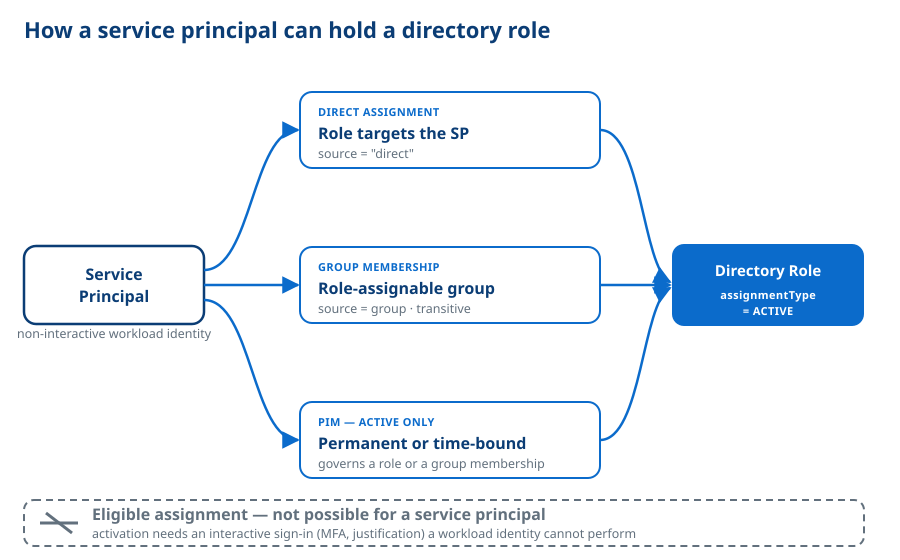

# Directory roles and service principals

This document explains, in detail, the different ways a **Service Principal**
can hold a **Directory Role** — and why one common way that applies to *users*
never applies to a Service Principal. It is the reference behind the
`directoryRoles` and `groupMemberships` fields of the [Audit Report](../README.md#the-audit-report).

The domain terms in **bold** (Service Principal, Directory Role, Via-group
attribution, …) are the ones defined in [`CONTEXT.md`](../CONTEXT.md); this
document assumes them.

## The short version

A Service Principal can hold a Directory Role through three mechanisms, which
overlap:

1. **Direct assignment** — the role targets the Service Principal itself.
2. **Group membership** — the Service Principal is a (transitive) member of a
   **role-assignable** group that holds the role.
3. **PIM (Privileged Identity Management)** — the governance plane that manages
   either of the above. A PIM assignment can be **permanent** or **time-bound**;
   for a Service Principal it is always **active** (never eligible).

In every one of these cases the assignment Spyglass records is
**active**: the role (or the group membership that confers it) is in force right
now. A Service Principal can **never** hold an **eligible** assignment — the kind
a user must *activate* before use — because activation is an interactive act a
non-interactive identity cannot perform. The rest of this document spells out
each case and the reasoning.

## Two axes, not one

It helps to separate two independent questions:

- **Path** — *how* does the role reach the Service Principal? Either **directly**
  (the assignment targets the SP) or **via a group** (the assignment targets a
  role-assignable group the SP belongs to).
- **State** — *what kind* of assignment is it? This splits two ways:
  - **active vs eligible** — an **active** assignment is in force now; an
    **eligible** assignment (users only) must be *activated* first.
  - **permanent vs time-bound** — independently of the above, an assignment is
    either **permanent** (no end) or **time-bound** (a start/end window after
    which it expires automatically).

So the *state* of an assignment is one of four combinations: permanent active,
time-bound active, permanent eligible, time-bound eligible. **PIM (Privileged
Identity Management) is the system that governs all four** — it is the management
plane for privileged assignments, not a separate path. A permanent active
assignment is just as much a PIM assignment as a time-bound one; PIM does not
mean "time-bound".

For a Service Principal, only the two **active** combinations are possible
(permanent active and time-bound active); both **eligible** combinations are
impossible (see [Why eligible is impossible](#why-eligible-is-impossible)). That
is why the [graphic](../assets/sp-directory-role-paths.svg) draws "PIM" alongside
the two paths — it decorates either path with an active (permanent or time-bound)
assignment, never an eligible one.

## Case 1 — Direct assignment

The role is assigned to the Service Principal's own object. Spyglass records this
with `source = "direct"` and `sourceGroupId = null` on the
[`DirectoryRoleRecord`](../src/spyglass/models.py).

A direct assignment is always **active** for an SP, and that active assignment is
in turn either:

- **Permanent** — a standing assignment with no end date. `startDateTime` and
  `endDateTime` are typically both absent.
- **Time-bound** — an assignment with a start and an end, after which it expires
  automatically. `startDateTime` / `endDateTime` carry the window.

Both surface identically as `assignmentType = "active"`, because both are in
force now. The only observable difference is whether the assignment carries dates
(time-bound) or not (permanent) — Spyglass keeps the raw dates rather than
labelling the assignment "permanent" vs "time-bound", so that distinction stays a
consumer-side judgment.

> Under the hood, Spyglass reads the active **role assignment schedules**
> (`roleManagement/directory/roleAssignmentSchedules`) filtered to the SP's
> `principalId`. This single endpoint returns both permanent and time-bound
> *active* assignments. It deliberately does **not** read the *eligibility*
> schedules — see [Why eligible is impossible](#why-eligible-is-impossible).

## Case 2 — Via group membership

A **role-assignable** group (`isAssignableToRole = true`) can itself hold a
Directory Role. Every member of that group then effectively holds the role. If
the Service Principal is a member — directly or transitively, through any chain
of nested groups — the role is attributed to it. This is the **Via-group
attribution** rule.

Spyglass records such a role with `source = <group display name>` and
`sourceGroupId = <group id>`, so the path is visible. Attribution follows the
**transitive** membership closure: the role is credited even when the SP reaches
the role-assignable group through intermediate groups that are *not* themselves
role-assignable. Only the group that *holds the role* must be role-assignable.

The *membership* itself — like the direct assignment in Case 1 — can be either:

- **Standing** — the SP is a plain, directly-added member of the group, outside
  of PIM.
- **PIM for Groups, active** — the SP holds an active membership of the group
  managed by PIM, which (like a direct role assignment) is itself either
  **permanent** or **time-bound**. This is recorded on the
  [`GroupMembershipRecord`](../src/spyglass/models.py) as
  `pimMembership = "assigned"` (a role-assignable group the SP is *not* a PIM
  member of is `"none"`; non-role-assignable groups, where the distinction does
  not matter for role inheritance, are left `null`).

Only **member** access confers role inheritance; an **owner** relationship to the
group does not, and Spyglass drops owner schedules when computing PIM-for-Groups
membership.

## Case 3 — PIM, for both directory roles and groups

PIM is the governance plane behind both Case 1 and Case 2 — it is *how* those
active assignments are created, tracked, and (when time-bound) expired. For a
Service Principal it shows up as:

- **Active PIM directory-role assignment** — the SP holds a role through PIM,
  either **permanently** or for a **time-bound** window. It is active right now;
  a time-bound one expires automatically.
- **Active PIM-for-Groups membership** — the SP is an active member (again,
  permanent or time-bound) of a role-assignable group; for as long as the
  membership is active, every role on that group is attributed to the SP.

In both cases the assignment is **active**, never eligible.

### Why an *active* PIM assignment for a service principal is useful

Even though a Service Principal cannot *activate* anything, an **active**
PIM assignment is still meaningful and is a legitimate, deliberate
configuration:

- **Time-boxing standing privilege.** A workload that needs an elevated role only
  for a migration window, a scheduled job, or a temporary integration can be
  granted a **time-bound** active assignment with an end date. The privilege
  evaporates on its own; nobody has to remember to remove it. This is
  least-privilege over time, applied to a non-interactive identity.
- **Auditability and review.** PIM assignments — permanent and time-bound alike —
  are tracked, attributable, and surface in access reviews. Granting an SP an
  *active* (not eligible) PIM assignment puts its privilege under the same
  governance machinery as human privileged access, while accepting that the SP
  cannot perform just-in-time activation.
- **Group-scoped elevation.** With PIM for Groups, a single role-assignable group
  can carry several Directory Roles, and an SP can be made an active member of it
  (permanent or time-bound). One membership then confers a curated bundle of
  roles — and, when time-bound, with an automatic expiry.

In short: PIM for a Service Principal is about **bounded, governed, standing
privilege** (whether permanent or time-bound), not about just-in-time elevation.

## Why eligible is impossible

PIM offers two assignment states: **eligible** and **active**.

- An **active** assignment is usable immediately and continuously until it
  expires (or forever, if permanent).
- An **eligible** assignment is *not* usable as-is. The principal must first
  **activate** it: an explicit, interactive step that typically requires signing
  in, passing **multi-factor authentication**, and often supplying a
  justification or a ticket reference, after which the role is active for a
  limited session.

That activation step is the whole point of eligibility — it is what makes the
privilege just-in-time. And it is exactly what a **Service Principal cannot do**:
a Service Principal is a **non-interactive workload identity**. It authenticates
with a client secret or certificate to obtain a token; there is no human, no
sign-in prompt, no MFA challenge, and no UI in which to click "Activate". With no
way to perform the activation, an eligible assignment would be permanently
dormant — it could never be turned into usable access.

For this reason eligible assignments **do not apply** to Service Principals, on
either path:

- An eligible *directory-role* assignment to the SP could never be activated.
- An eligible *PIM-for-Groups* membership could never be activated, so the SP
  would never actually become a member and would never inherit the group's roles.

This is why Spyglass models the situation the way it does, and why the
`directoryRoles` and `groupMemberships` data is shaped accordingly:

- `DirectoryRoleRecord.assignmentType` is the single literal `"active"`. There is
  no `"eligible"` value, because the value could never legitimately occur for the
  audit subject.
- `GroupMembershipRecord.pimMembership` is `"assigned"` or `"none"` (or `null`
  where it does not apply). There is no eligible state.
- The collector reads only the **active** assignment schedules for both directory
  roles and PIM for Groups, and skips the eligibility schedules entirely. Reading
  them would only ever return empty results for the self path, and on the
  via-group path could otherwise tempt an implementation into crediting an SP with
  a role it could never activate.

## Worked summary

| What the SP holds | Path (`source`) | `assignmentType` / `pimMembership` | How recorded |
| --- | --- | --- | --- |
| Permanent active role on the SP | direct (`"direct"`) | `assignmentType = "active"`, no dates | `directoryRoles[]` |
| Time-bound active role on the SP | direct (`"direct"`) | `assignmentType = "active"`, with dates | `directoryRoles[]` |
| Role from a standing group membership | via group (group name) | `assignmentType = "active"` on the role; `pimMembership = "none"` on the group | `directoryRoles[]` + `groupMemberships[]` |
| Role from a PIM-for-Groups active membership | via group (group name) | `assignmentType = "active"` on the role; `pimMembership = "assigned"` on the group | `directoryRoles[]` + `groupMemberships[]` |
| *Any eligible assignment* | — | *cannot occur* | *not collected* |

## See also

- [`README.md`](../README.md) — the tool, the Audit Report, required permissions.
- [`CONTEXT.md`](../CONTEXT.md) — canonical definitions of the domain terms.
- [`src/spyglass/models.py`](../src/spyglass/models.py) — the typed schema for
  `DirectoryRoleRecord` and `GroupMembershipRecord`.
- [`src/spyglass/entra.py`](../src/spyglass/entra.py) — the directory-plane
  collector that implements the cases above.
